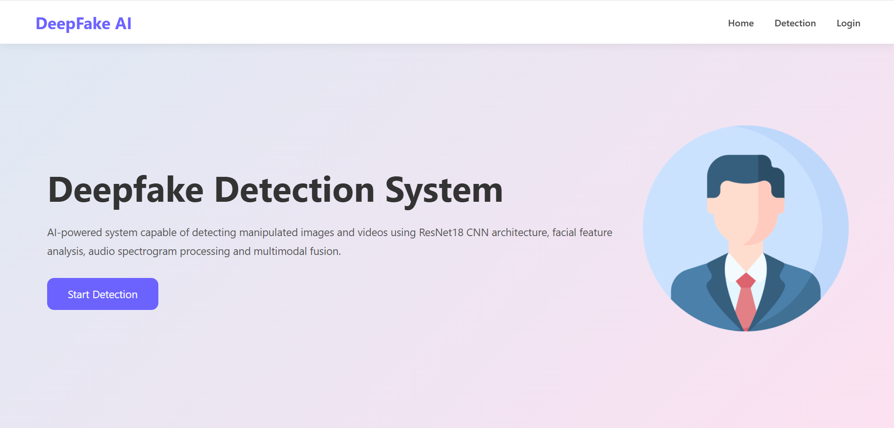
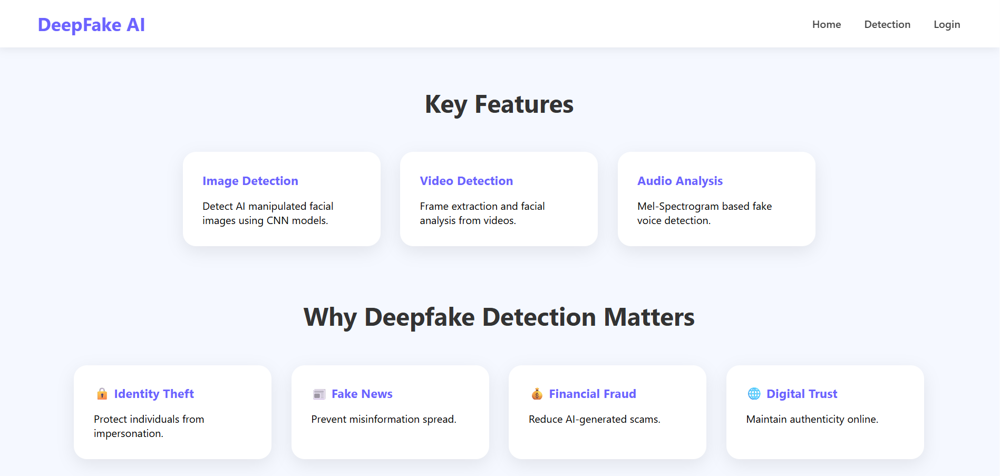
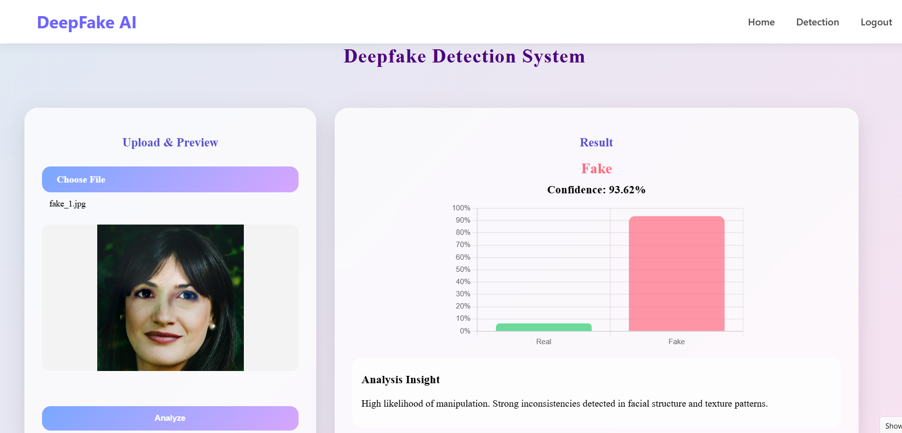
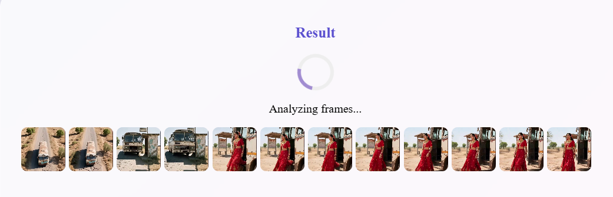
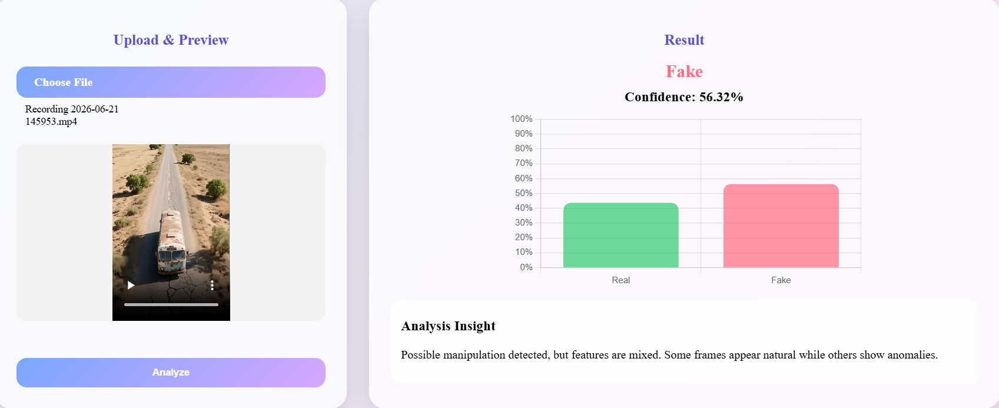

# 🎭 Deepfake AI Detection System

A Deepfake Detection System built using **Flask, PyTorch, OpenCV, and Audio Analysis** to identify AI-generated fake images and videos. The system combines visual and audio-based detection techniques to improve prediction reliability.

---

## 📌 Project Overview

Deepfake technology uses Artificial Intelligence to manipulate images, videos, and audio, making it difficult to distinguish real content from fake content.

This project detects deepfakes by analyzing:

- 🖼️ Images using a CNN-based Deep Learning Model
- 🎥 Videos through frame extraction and facial analysis
- 🔊 Audio through Mel-Spectrogram generation and classification
- 🧠 Multi-modal fusion of visual and audio predictions

The system classifies uploaded media as:

- ✅ Real
- ❌ Fake
- ⚠️ Not Sure (for low-confidence image predictions)

---

## 🚀 Features

### Image Deepfake Detection

- Upload JPG, JPEG, or PNG images
- Face-based deepfake analysis
- Confidence score generation
- Real vs Fake probability visualization

### Video Deepfake Detection

- Video frame extraction
- Face detection using Haar Cascade
- Frame-by-frame prediction
- Average visual confidence calculation

### Audio Analysis

- Audio extraction from video
- Mel-Spectrogram generation
- Deep learning-based audio classification

### Multi-Modal Fusion

Final prediction combines:

- 70% Visual Analysis
- 30% Audio Analysis

to improve overall detection accuracy.

### User Authentication

- User Registration
- Login System
- Session Management
- Protected Detection Feature

---

## 🏗️ Project Architecture

```text
User Upload
     │
     ▼
 ┌─────────────┐
 │ Flask Server│
 └─────────────┘
     │
     ├──────────────► Image Detection
     │
     └──────────────► Video Detection
                         │
             ┌───────────┴───────────┐
             ▼                       ▼
       Visual Analysis         Audio Analysis
             │                       │
             └───────────┬───────────┘
                         ▼
                  Fusion Layer
                         ▼
                 Final Prediction
```

## 🛠️ Technologies Used

### Backend

- Python
- Flask

### Deep Learning

- PyTorch
- Torchvision

### Computer Vision

- OpenCV
- Haar Cascade Face Detection

### Audio Processing

- Librosa
- MoviePy
- Matplotlib

### Frontend

- HTML5
- CSS3
- JavaScript
- Chart.js

---

## 📂 Project Structure

```text
deepfake_ai_project/
│
├── models/
│   ├── deepfake_model.pth
│   └── audio_model.pth
│
├── src/
│   ├── model.py
│   ├── train.py
│   ├── inference.py
│   ├── face_extraction.py
│   └── video_processing.py
│
├── templates/
│   ├── index.html
│   ├── home.html
│   ├── login.html
│   ├── navbar.html
│   └── footer.html
│
├── static/
│
├── uploads/
│
├── app.py
├── audio_predict.py
├── video_predict.py
├── train_audio.py
├── requirements.txt
└── README.md
```

---

## ⚙️ Installation

### Clone Repository

```bash
git clone https://github.com/Rimsha-Katoch/Deepfake-detection-system.git

```

### Create Virtual Environment

```bash
python -m venv .venv
```

### Activate Virtual Environment

Windows:

```bash
.venv\Scripts\activate
```

Linux / Mac:

```bash
source .venv/bin/activate
```

### Install Dependencies

```bash
pip install -r requirements.txt
```

---

## ▶️ Run Application

```bash
python app.py
```

Open browser:

```text
http://127.0.0.1:5000
```

---

## 🧠 Machine Learning Model

### Visual Detection Model

- Architecture: ResNet18
- Transfer Learning
- Fine-Tuned Final Layers
- Binary Classification:
  - Real
  - Fake

### Audio Detection Model

- ResNet18-based Classifier
- Mel-Spectrogram Inputs
- Binary Classification

---

## 📊 Prediction Output

Example:

```json
{
  "result": "Fake",
  "confidence": 89.2,
  "real_conf": 10.8,
  "fake_conf": 89.2
}
```

---

## 📈 Future Improvements

- MTCNN / RetinaFace Face Detection
- Transformer-Based Deepfake Detection
- Real Deepfake Audio Datasets
- Mobile Application Integration
- Cloud Deployment
- Live Webcam Detection

---

## 📷 Screenshots

Add screenshots here:

### Home Page




### Login Page


### Image Detection Result



### Video Detection Result




---

## 👩‍💻 Author

**Rimsha Katoch**

B.Tech Computer Science Engineering

Punjab Technical University

---


### Deployment

For testing or deployment, download the model files separately and copy them into the `models/` directory before starting the application.

## ⭐ If you like this project

Give this repository a Star ⭐ and feel free to contribute.
